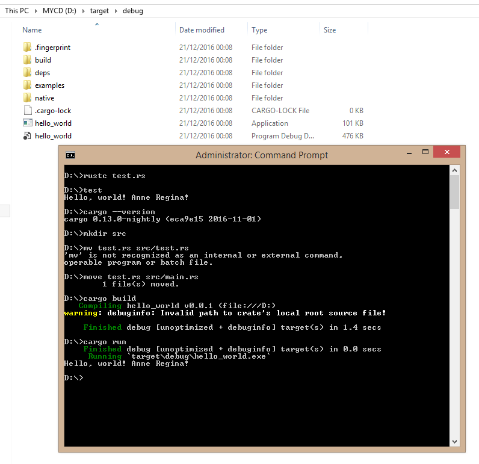

# learning-rust
Learn how future programming language expressed. Fast, Efficient and Memory Safe.

Review Saya Seputar Rust Programming.

Berbicara bahasa pemograman dan penelitian tentang bahasa pemograman bagi saya sangat menyenangkan sekali, termasuk kemunculan Rust Programming language yang menjadi referensi baru. Dari Rust Programming Language saya belajar sebuah arsitektur modern programming language yang didesain untuk beberapa tahun yang akan datang. (Future Programming Language)

Rust adalah bahasa dengan general purpose language, bahasa low level yang bisa membantu kita untuk mengeksplorasi potensi sisi system, embedded system, dan hal hal kritis terkait performance.

Salah satu aplikasi menarik yang dibuat dengan rust programming language adalah pembuatan servo sebuah parallel browser engine https://servo.org/

Challenge kedepanya untuk kita dengan masifnya jumlah data adalah permasalahan high performance, disisi lain implementasi seperti teknologi virtual reality didalam web atau WebVR juga masih memiliki beberapa isu yang harus dibenahi. Rust sudah mempersiapkannya/

Apa perbedaan RUST dan C++?

Sebelum saya membuat tulisan ini saya membaca terlebih dahulu beberapa opini di forum stackoverflow dan quora, sebagian berpendapat RUST jika sudah memasuki tahap matang (soon) akan mampu mengungguli C++. oh ya?? kenapa bisa?

"Safe Code" adalah kunci utama yang berperan besar.

Rust adalah bahasa dengan safety code dimana object diatur oleh bahasa pemograman tersebut dari awal hingga akhir. Developer tidak perlu lagi melakukan pointer arithmatic dan manajemen memory seperti yang kita lakukan dalam bahasa C dan C++

Disini saya akan berusaha mempermudah penjelasanya sesederhana mungkin agar mudah dipelajari. Pada safe code, object yang dibuat sudah diberikan alokasi memory, didesain agar tidak ada kemungkinan untuk mengakses lokasi memory yang berada diluar ruang lingkup.

Ketika kita sudah selesai berinteraksi dengan object maka proses untuk disalokasi memory akan dilakukan secara otomatis. Sehingga kita tidak perlu secara manual untuk membersihkan memory yang sudah digunakan.

Sebaliknya pada unmanaged code seperti C++ memang saya akui cukup sulit untuk membuat sebuah program yang benar dan terbebas dari bug, sehingga seringkali menimbulkan celah yang bisa dicompromise. Ancaman yang paling besar adalah buffer overflow attack yaitu ketika seseorang bisa mengakses informasi melebihi dari informasi yang disediakan pada alokasi memory space untuk program, Artinya seseorang bisa melakukan modifikasi di level bawah pada lokasi memori yang berada diluar jangkauan oleh program.

Desain utama dari Rust Programming language adalah fast, efficient and memory safe system. Ini adalah desain yang sudah dijadikan standard modern programming language untuk kedepanya sama seperti yang diterapkan dalam Go Programming Language atau golang.

Beberapa sistem operasi sudah dibuat menggunakan bahasa pemograman rust, salah satunya adalah redox :
https://github.com/redox-os/redox

Hal menarik lainya adalah machine learning yang didesain dengan Rust Programming Language, kita bisa membuat classic, deep atau hybrid machine learning dengan bahasa satu ini semuanya sudah dijelaskan di buku yang judulnya amat terkenal yaitu :

Machine Learning for Hacker
http://autumnai.com/leaf/book
